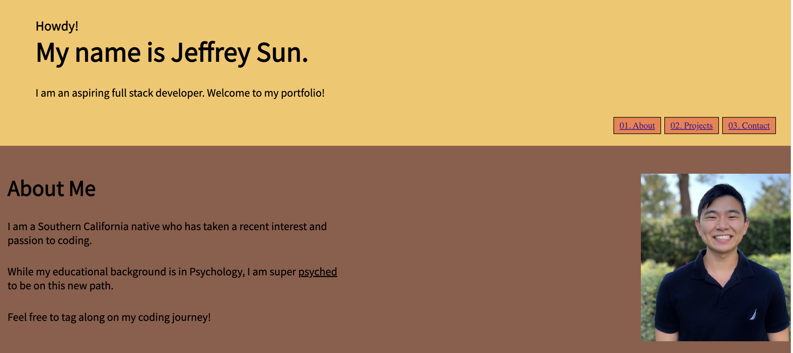
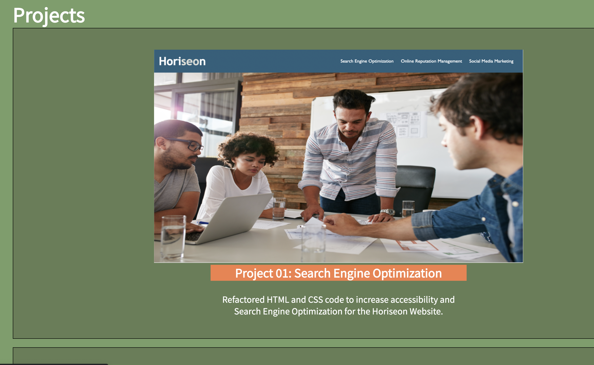
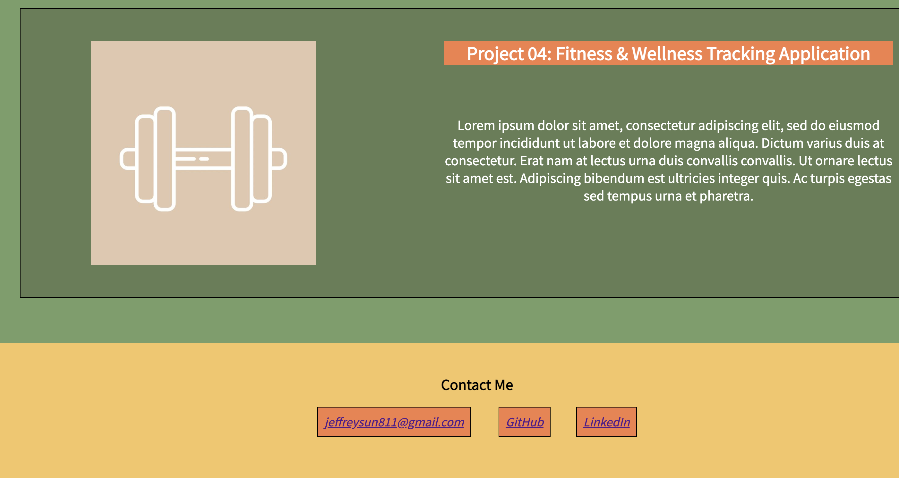
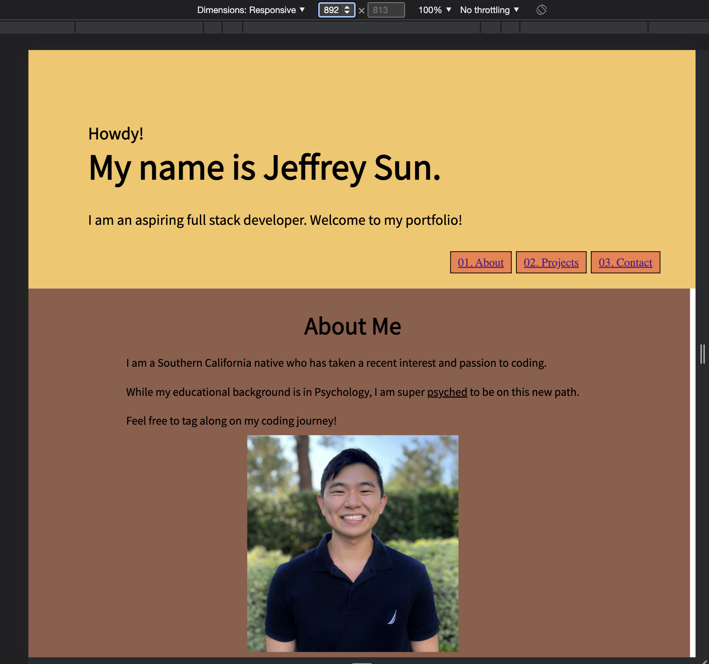

# Challenge Two: Professional Portfolio

## Project Description

This challenge involved coding our very own professional portfolio from scratch. Portfolios are essential to developers and employers as they allow the developer to showcase accomplishments, stylistic ability, and even a bit of personality. This challenge involved utilizing HTML, CSS, media queries, and variables to showcase our applications. Instead of projects completed, I have used placeholders since there has only been one deployed application. These placeholders are passion project ideas I would like to explore in the future. 

### Portfolio Screenshots

The following images shows the header, navigation bar, and About Me section:

### Deployed Applications 

The following images show the Projects and Contact sections in the portfolio:

### Responsive Layout

The following image shows a responsive layout of the Header and About Me section:

### Link to Github Page
[https://jffsun.github.io/chall-one-accessibility/](https://jffsun.github.io/chall-one-accessibility/).

### Link to Github Respository
[https://github.com/jffsun/chall-one-accessibility](https://github.com/jffsun/chall-one-accessibility).